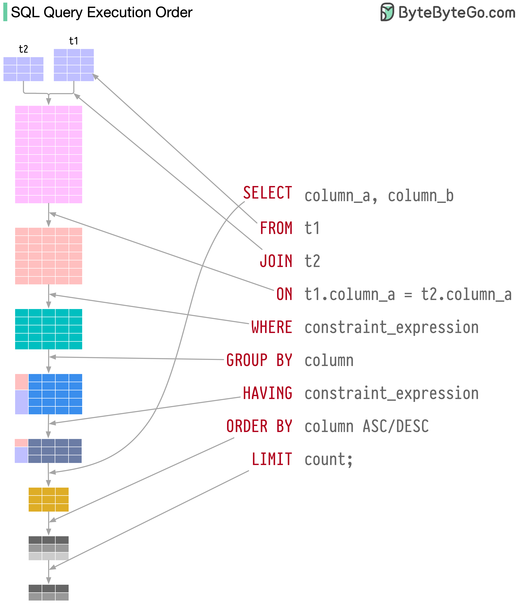

# Query

Table of Contents

- [Query](#query)
  - [INSERT Statement](#insert-statement)
  - [UPDATE Query](#update-query)
  - [DELETE Statement](#delete-statement)
  - [SELECT Statement](#select-statement)

---

## INSERT Statement

INSERT statement is used to store or add data in MySQL table within the database. We can perform insertion of records in two ways using a single query in MySQL:

1. Insert record in a single row
2. Insert record in multiple rows

**Single row**
The below is generic syntax of SQL **INSERT INTO** command to insert a single record in MySQL table:

```sql
INSERT INTO table_name ( field1, field2,...fieldN )
VALUES
( value1, value2,...valueN );
```

If we want to **insert multiple records** within a single command, use the following statement:

```sql
INSERT INTO table_name VALUES  
( value1, value2,...valueN )  
( value1, value2,...valueN )  
...........  
( value1, value2,...valueN );    
```

**INSERT Example**
First, create a table "People" in the database using the following command:

```sql
CREATE TABLE people(
    id int NOT NULL AUTO_INCREMENT,
    name varchar(45) NOT NULL,
    occupation varchar(35) NOT NULL,
    age int,
    PRIMARY KEY (id)
);  
```

1. If we want to store single records for all fields, use the syntax as follows:

```sql
INSERT INTO people (id, name, occupation, age)
VALUES (101, 'Peter', 'Engineer', 32);
```

2. If we want to store multiple records, use the following statements where we can either specify all field names or don't specify any field.

```sql
INSERT INTO people VALUES
(102, 'Joseph', 'Developer', 30),
(103, 'Mike', 'Leader', 28),
(104, 'Stephen', 'Scientist', 45);
```

3. If we want to store records without giving all fields, we use the following partial field statements. In such case, it is mandatory to specify field names.

```sql
INSERT INTO people (name, occupation) VALUES
('Stephen', 'Scientist'),
('Bob', 'Actor');
```

```text
The default format of the date in MySQL is YYYY-MM-DD.
```

---

## UPDATE Query

UPDATE query is a DML statement used to modify the data of the MySQL table within the database.

```sql
UPDATE table_name     
SET column_name1=new-value1,   
    column_name2=new-value2,
    ...    
[WHERE Clause]  
```

**Update Single Column**
This query will update the email id of Java course with the new id as follows:

first create email column

```sql
ALTER TABLE people
ADD email VARCHAR(45) NULL DEFAULT NULL
AFTER age;
```

```sql
UPDATE people
SET email = 'joseph@scrum123.com'
WHERE name = 'Joseph';
```

**Update Multiple Columns**
The UPDATE statement can also be used to update multiple columns by specifying a comma-separated list of columns. Suppose we have a table as below:

```sql
UPDATE people
SET name = 'Nut', email = 'nut@gmail.com'
WHERE id = 105;
```

**UPDATE Statement to Replace String**
We can also use the UPDATE statement in SQL to change the string name in the particular column. The following example updates the domain parts of emails of Android course:

```sql
UPDATE people
SET email = REPLACE(email,'@gmail.com','@scrum123.com')
WHERE name = 'Nut';
```

---

## DELETE Statement

DELETE statement is used to remove records from the MySQL table that is no longer required in the database.

```sql
DELETE FROM table_name WHERE condition;  
```

**DELETE Statement Examples**
if we want to delete an trainer whose id is 5, we should use the DELETE statement with the WHERE clause. See the below query:

```sql
DELETE FROM people WHERE id=101;
```

**DELETE and LIMIT Clause**
Limit clause is used to restrict the count of rows returns from the result set, rather than fetching the whole records in the table. Sometimes we want to limit the number of rows to be deleted from the table; in that case, we will use the LIMIT clause as follows:

```sql
DELETE FROM table_name  
WHERE condition   
ORDER BY colm1, colm2, ...  
LIMIT row_count;  
```

Exmple

```sql
DELETE FROM logs
WHERE type!="error"
ORDER BY created_at ASC
LIMIT 10;
```

**DELETE and JOIN Clause**
The JOIN clause is used to add the two or more tables in MySQL. We will add the JOIN clause with the DELETE statement whenever we want to delete records from multiple tables within a single query. See the below query:

```sql
DELETE employees, payment FROM employees
INNER JOIN payment
ON employees.emp_id = payment.emp_id
WHERE employees.emp_id = 102;
```

Ref: <https://saixiii.com/database-sql-transaction/>

---

## SELECT Statement

The SELECT statement in MySQL is used to **fetch data from one or more tables**. We can retrieve records of all fields or specified fields that match specified criteria using this statement.

```sql
SELECT field_name1, field_name 2,... field_nameN
FROM table_name1, table_name2...
[WHERE condition]
[GROUP BY field_name(s)]
[HAVING condition]
[ORDER BY field_name(s)]
[OFFSET M ][LIMIT N];
```

Syntax for all fields:

```sql
SELECT * FROM tables [WHERE conditions]  
[GROUP BY fieldName(s)]
[HAVING condition]
[ORDER BY fieldName(s)]
[OFFSET M ][LIMIT N];
```

| Parameter | Description |
| --------- | ----------- |
| field_name(s) or * | It is used to specify one or more columns to returns in the result set. The asterisk (*) returns all fields of a table. |
| table_name(s) | It is the name of tables from which we want to fetch data. |
| WHERE | It is an optional clause. It specifies the condition that returned the matched records in the result set. |
| GROUP BY | It is optional. It collects data from multiple records and grouped them by one or more columns. |
| HAVING | It is optional. It works with the GROUP BY clause and returns only those rows whose condition is TRUE. |
| ORDER BY | It is optional. It is used for sorting the records in the result set. |
| OFFSET | It is optional. It specifies to which row returns first. By default, It starts with zero. |
| LIMIT | It is optional. It is used to limit the number of returned records in the result set. |



**SELECT Statement Example:**
Let us understand how SELECT command works in MySQL with the help of various examples. Suppose we have a table named customer_list that contains the following data:

1. If we want to retrieve a single column from the table, we need to execute the below query:

```sql
SELECT customer_name FROM customer_list; 
```

2. If we want to query **multiple columns from the table**, we need to execute the below query:

```sql
SELECT customer_name, city FROM customer_list; 
```

3. If we want to fetch data from all columns of the table, we need to use all column's names with the select statement. Specifying all column names is not convenient to the user, so MySQL uses an asterisk (*) to retrieve all column data as follows:

```sql
SELECT * FROM customer_list; 
```

4. Here, we use the SUM function with the HAVING clause in the SELECT command to get the employee name, city, and total working hours. Also, it uses the GROUP BY clause to group them by the Name column.

```sql
SELECT customer_name, city
FROM customer_list
Order by city asc;
```

```sql
SELECT Name, city, SUM(working_hours) AS "total_working_hours"
FROM employee_detail
GROUP BY name
HAVING SUM(working_hours) > 5;
```

5. MySQL SELECT statement can also be used to retrieve records from multiple tables by using a JOIN statement. Suppose we have a table named "products" and "categories" that contains the following data:

```sql
SELECT product_name, unit, category_name, price
FROM products INNER JOIN categories
ON products.category_id = categories.category_id
WHERE price > 100.00
ORDER BY product_name;
```
