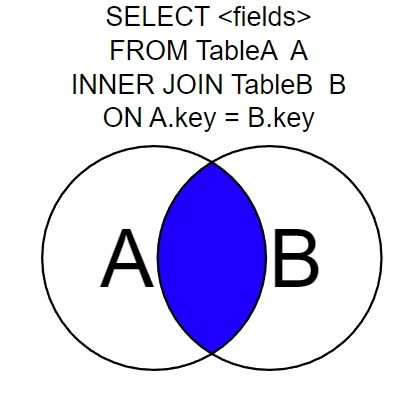
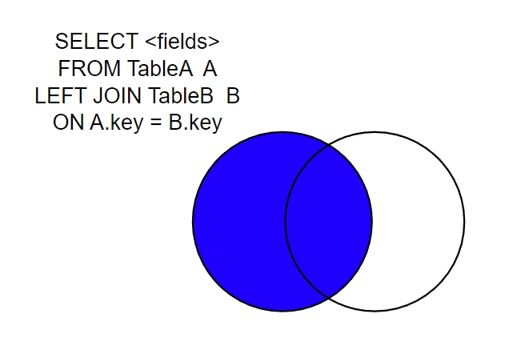
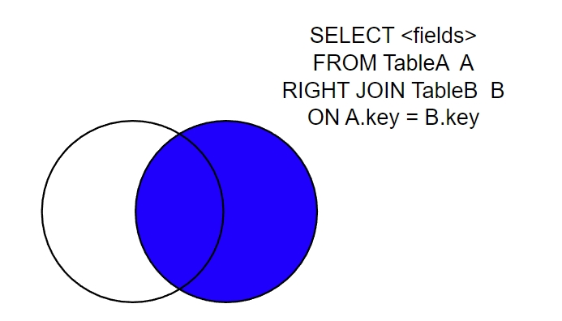

# Joins

Table of Contents
- [Joins](#joins)
  - [Inner JOIN (Simple Join)](#inner-join-simple-join)
  - [Left Outer Join](#left-outer-join)
  - [Right Outer Join](#right-outer-join)

SQL JOINS are used with SELECT statement. It is used to retrieve data from multiple tables. It is performed whenever you need to fetch records from two or more tables.

There are three types of MySQL joins:

- MySQL INNER JOIN (or sometimes called simple join)
- MySQL LEFT OUTER JOIN (or sometimes called LEFT JOIN)
- MySQL RIGHT OUTER JOIN (or sometimes called RIGHT JOIN)


---

## Inner JOIN (Simple Join)

INNER JOIN is used to return all rows from multiple tables where the join condition is satisfied. It is the most common type of join.



Syntax:

```sql
SELECT columns
FROM table1
INNER JOIN table2
ON table1.column = table2.column;
```

Execute the following query:

```sql
SELECT books.id, books.title, authors.first_name, authors.last_name
FROM books
INNER JOIN authors ON books.author_id = authors.id;
```

Assign name:

```sql
SELECT b.id, b.title, a.first_name, a.last_name
FROM books b
INNER JOIN authors a ON b.author_id = a.id;
```

---

## Left Outer Join

The LEFT OUTER JOIN returns all rows from the left hand table specified in the ON condition and only those rows from the other table where the join condition is fulfilled.



Syntax:

```sql
SELECT columns  
FROM table1  
LEFT [OUTER] JOIN table2  
ON table1.column = table2.column;
```

Execute the following query:
books: left
authors: right

```sql
SELECT books.id, books.title, books.type, authors.last_name AS author
FROM books
LEFT JOIN authors ON books.author_id = authors.id;
```

You can Join Multiple Table:
books: left
authors: right
translators: right

```sql
SELECT books.id, books.title, books.type, authors.last_name AS author, translators.last_name AS translator
FROM books
LEFT JOIN authors ON books.author_id = authors.id
LEFT JOIN translators ON books.translator_id = translators.id;
```

---

## Right Outer Join

Right Outer Join returns all rows from the RIGHT-hand table specified in the ON condition and only those rows from the other table where he join condition is fulfilled.



Syntax:

```sql
SELECT columns
FROM table1
RIGHT [OUTER] JOIN table2
ON table1.column = table2.column;
```

Execute the following query:
books: left
editors: right

```sql
SELECT books.id, books.title, editors.last_name AS editor
FROM books
RIGHT JOIN editors ON books.editor_id = editors.id;
```

---

Ref: <https://learnsql.com/blog/sql-join-examples-with-explanations/>
